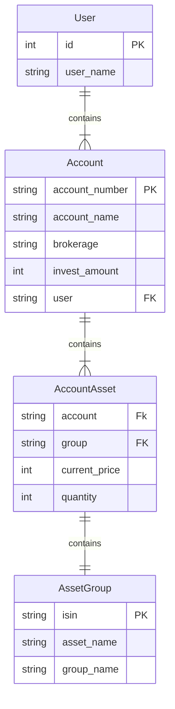

# Investment Service
> - 고객 투자 데이터 응답 REST API  개발

## 프로젝트 구조 설명

**core**
- 환경 설정 (settings.py)
- 메인 URL 주소 (urls.py)

**investment**
- 메인 프로젝트 디렉토리
- 모델 설정 (models.py)
- 어드민 설정 (amdin.py)
- views
  - API를 구현한 비즈니스 로직
- serializers.py
  - 모델 인스턴스를 JSON 형태로 렌더링
- urls.py
  - API 주소
- management
    - commands
      - dataloading.py
          - Command 기능을 이용한 배치 프로그램 파일
          - 제공된 테스트 데이터 셋을 API 에서 사용할 수 있도록 정제하여 로딩
          - ```python manage.py dataloading``` 으로 실행

# ERD

