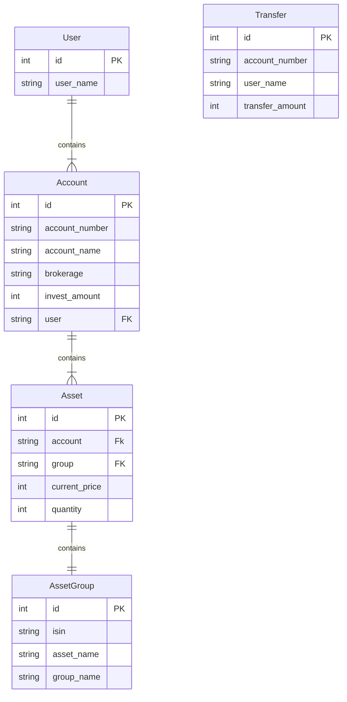

# Investment Service
## :bulb: 설명
> - 고객 투자 데이터 응답 REST API 입니다.

## :package: 설치하기
    git clone https://github.com/dev-choee/investment-service.git
    pip install requirements.txt

## :rocket: 어플리케이션 실행하기
    python manage.py runserver

## :card_file_box: 테스트 데이터 로딩하기
    python manage.py dataloading


---
## 프로젝트 구조 설명

**core**
- 환경 설정 (settings.py)
- 메인 URL 주소 (urls.py)

**investment**
- 메인 프로젝트 디렉토리
- 모델 설정 (models.py)
- 어드민 설정 (amdin.py)
- views
  - API를 구현한 비즈니스 로직
- serializers.py
  - 모델 인스턴스를 JSON 형태로 렌더링
- urls.py
  - API 주소
- management
    - commands
      - dataloading.py
          - Command 기능을 이용한 배치 프로그램 파일
          - 제공된 테스트 데이터 셋을 API 에서 사용할 수 있도록 정제하여 로딩

## 개발 내용
### 1. 로그인,로그아웃, 회원가입 구현
  - rest-auth 라이브러리 사용

### 2. 모델링
  - User: 기본 user 사용 
    - get_user_model()로 사용
  - Account
    - 계좌 테이블
  - Asset
    - 자산 테이블
  - AssetGroup
    - 자산 그룹 정보 테이블
  - Transfer
    - 입금 거래 테이블
    

    
### 3. Batch 프로그램 작성
- [management > commands] dataloading.py 
  - 제공된 테스트 데이터 셋을 API 에서 사용할 수 있도록 정제하여 로딩
  - ```python manage.py dataloading``` 으로 실행

### 4. API 구현
**투자 정보 조회 및 투자금 입금 기능에 대하여 API를 구현하였습니다.**

| Method          | URL                                  | Description     |
|-----------------|--------------------------------------|-----------------|
| GET             | /account/                            | 투자 메인 화면 조회     |
| GET             | /account-asset/ <str:pk>             | 투자 상세 화면        |
| GET             | /asset/ <str:fk>                     | 보유 종목 화면        |
| POST            | /transfer-amount-1/                  | 투자금 입금 Phase 1  |
| POST            | /transfer-amount-2/                  | 투자금 입금 Phase 2  |

-[X] 투자 화면 조회
  - 로그인 한 회원의 id로 투자 화면 데이터를 조회합니다.
-[X] 투자 상세 화면 조회
  - 로그인 한 회원의 계좌 id로 투자 상세 화면 데이터를 조회합니다.
-[X] 보유 종목 화면 조회
  - 계좌 id로 보유 종목 화면 데이터를 조회합니다.
-[X] 투자금 입금 Phase 1
  - 요청 데이터로 사용자 및 계좌를 검증하고 입금 거래 정보를 DB에 저장하며 거래 id를 응답합니다.
-[X] 투자금 입금 Phase 2
  - 요청 데이터로 사용자 및 거래 정보를 검증하고 고객의 총 자산을 업데이트하며 자산 업데이트 상태를 응답합니다. 

**추가**
  
| Method          | URL                                  | Description      |
|-----------------|--------------------------------------|------------------|
| POST            | /rest-auth/login/                    | 로그인              |
| POST            | /rest-auth/Logout/                   | 로그아웃             |
| POST            | /rest-auth/password/reset/           | 비밀번호 초기화         |
| POST            | /rest-auth/password/reset/confirm/   | 비밀번호 초기화 확인      |
| POST            | /rest-auth/password/change/          | 비밀번호 변경          |
| GET, PUT, Patch | /rest-auth/user/                     | 사용자 조회           |
| POST            | /rest-auth/registration/             | 회원가입             |
| POST            | /rest-auth/registration/verify-email | 이메일 인증           |
-[X] 로그인, 로그아웃, 회원가입 등
  - django-rest-auth 라이브러리를 사용하였습니다.


