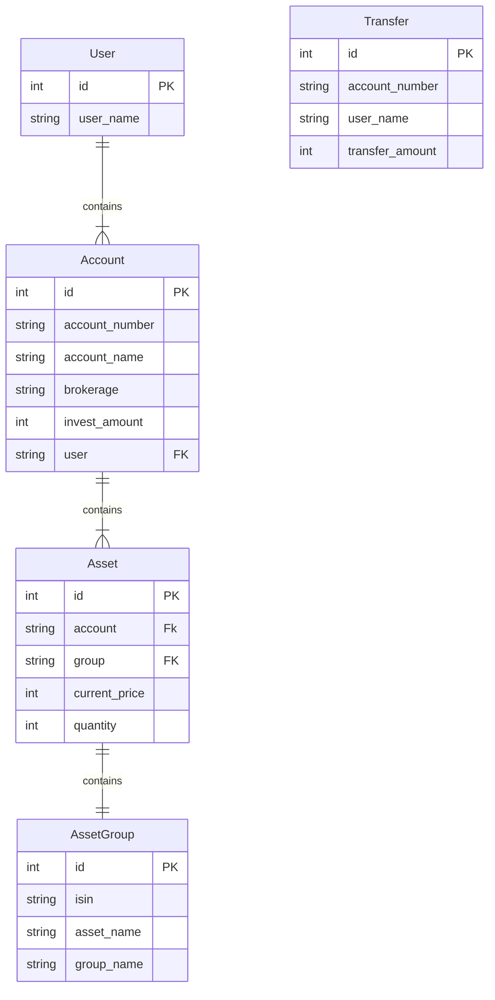

# Investment Service
## :bulb: 설명
> - 주어진 고객 투자 데이터 셋을 API에서 사용할 수 있도록 정제하여 로딩합니다.
> - 데이터 셋에 포함된 특정 고객의 자산 정보를 조회 또는 입금하는 REST API 입니다.

## 프로젝트 구조 설명

**core**
- 환경 설정 (settings.py)
- 메인 URL 주소 (urls.py)

**investment**
- 메인 프로젝트 디렉토리
- 모델 설정 (models.py)
- 어드민 설정 (amdin.py)
- views
  - API를 구현한 비즈니스 로직
- serializers.py
  - 모델 인스턴스를 JSON 형태로 렌더링
- urls.py
  - API 주소
- data_files
  - 주어진 데이터 셋 경로
- management
    - commands
      - dataloading.py
          - Command 기능을 이용한 배치 프로그램 파일
          - 제공된 테스트 데이터 셋을 API 에서 사용할 수 있도록 정제하여 로딩

## 개발 내용

### 1. 모델링
  - User: 기본 user 사용 
    - get_user_model()로 사용
  - Account
    - 계좌 테이블
  - Asset
    - 자산 테이블
  - AssetGroup
    - 자산 그룹 정보 테이블
  - Transfer
    - 입금 거래 테이블
    

    
### 2. 데이터 셋 로딩을 위한 Batch 프로그램 작성
- [management > commands] dataloading.py 
  - 제공된 테스트 데이터 셋을 API 에서 사용할 수 있도록 정제하여 로딩
  - ```python manage.py dataloading``` 으로 실행

### 3. API
**특정 고객의 투자 정보 조회 및 투자금 입금 기능에 대하여 API를 구현하였습니다.**

| Method          | URL                 | Description     |
|-----------------|---------------------|-----------------|
| GET             | /account/           | 투자 메인 화면 조회     |
| GET             | /account-asset/{pk} | 투자 상세 화면        |
| GET             | /asset/{fk}         | 보유 종목 화면        |
| POST            | /transfer-amount-1/ | 투자금 입금 Phase 1  |
| POST            | /transfer-amount-2/ | 투자금 입금 Phase 2  |

- [X] 투자 화면 조회
  - 로그인 한 회원의 id로 투자 화면 데이터를 조회합니다.
- [X] 투자 상세 화면 조회
  - 로그인 한 회원의 계좌 id로 투자 상세 화면 데이터를 조회합니다.
- [X] 보유 종목 화면 조회
  - 계좌 id로 보유 종목 화면 데이터를 조회합니다.
- [X] 투자금 입금 Phase 1
  - 요청 데이터로 사용자 및 계좌를 검증하고 입금 거래 정보를 DB에 저장하며 거래 id를 응답합니다.
- [X] 투자금 입금 Phase 2
  - 요청 데이터로 사용자 및 거래 정보를 검증하고 고객의 총 자산을 업데이트하며 자산 업데이트 상태를 응답합니다. 
  - hashlib 모듈의 sha3_512 알고리즘을 사용하였습니다.

**추가**
  
| Method          | URL                                  | Description      |
|-----------------|--------------------------------------|------------------|
| POST            | /rest-auth/login/                    | 로그인              |
| POST            | /rest-auth/Logout/                   | 로그아웃             |
| POST            | /rest-auth/password/reset/           | 비밀번호 초기화         |
| POST            | /rest-auth/password/reset/confirm/   | 비밀번호 초기화 확인      |
| POST            | /rest-auth/password/change/          | 비밀번호 변경          |
| GET, PUT, Patch | /rest-auth/user/                     | 사용자 조회           |
| POST            | /rest-auth/registration/             | 회원가입             |
| POST            | /rest-auth/registration/verify-email | 이메일 인증           |
- [X] 로그인, 로그아웃, 회원가입 등
  - django-rest-auth 라이브러리를 사용하였습니다.

--- 
## :package: 설치 및 개발환경 셋팅하기
    # 설치
    git clone https://github.com/dev-choee/investment-service.

    # 가상환경 만들기 및 경로로 이동
    C:\project>python -m venv myvenv
    C:\project>cd myvenv/Scripts

    # 가상환경 실행
    C:\project\myvenv\Scripts>activate.bat

    # 라이브러리 설치 
    pip install -r requirements.txt

## :card_file_box: 데이터베이스 마이그레이션하기
    python manage.py makemigrations
    python manage.py migrate

## :card_file_box: 테스트 데이터 로딩하기
    python manage.py dataloading

## :rocket: 어플리케이션 실행하기
    python manage.py runserver

---
# 테스트 시나리오 및 API 요청 응답 예시 
> 테스트 데이터 로딩 시 사용자 이름으로 User를 생성하며 비밀번호는 '0000'으로 발급됩니다.
> 
> '강하은' 고객의 정보를 통해 테스트를 진행하겠습니다.
> 1. 먼저 로그인을 진행합니다.
> 2. 로그인한 고객의 id로 고객의 투자 화면에 보여줄 계좌 데이터를 조회합니다.
> 3. 고객의 계좌 id로 투자 상세 화면에 보여줄 계좌 및 투자 테이터를 조회합니다.
> 4. 고객의 계좌 id로 투자 종목 화면에 보여줄 투자 데이터를 조회합니다.
> 5. 고객의 입금 요청을 확인 후 입금 거래 정보를 저장합니다.
> 6. 고객의 요청 정보와 서버의 데이터를 비교 확인 후 입금을 처리합니다.

**1. 로그인**
- '강하은' 고객으로 로그인 합니다. 
> - **POST** /rest-auth/login/
- 요청 데이터 
```json
{
    "username": "강하은",
    "email": "",
    "password": "0000"
}
```
- 응답 데이터 
```http request
HTTP 200 OK
Allow: POST, OPTIONS
Content-Type: application/json
Vary: Accept
```
```json
{
    "key": "ed88070d54f057988e60049487423a4b37e460d3"
}
```

**2. 투자 메인화면 조회**
- 로그인 되어있는 '강하은' 고객의 계좌 정보를 조회합니다.
> - **GET** /account/
- 요청 URL 
```djangourlpath
GET /account/
```
- 성공 응답 데이터 
```http request
HTTP 200 OK
Allow: OPTIONS, GET
Content-Type: application/json
Vary: Accept
```
```json
{
    "username": "강하은",
    "accounts": [
        {
            "id": 12,
            "account_name": "계좌12",
            "brokerage": "베스트투자",
            "account_number": "1114693681671.0",
            "total_amount": 1720661,
            "invest_amount": 1731955,
            "total_benefit": -11294,
            "roi": -0.65,
            "assets": [
                {
                    "market_value": 109620,
                    "current_price": 5481,
                    "quantity": 20,
                    "group": {
                        "isin": "KR7360750004",
                        "asset_name": "미국S&P500",
                        "group_name": "미국 주식"
                    }
                },
                {
                    "market_value": 88464,
                    "current_price": 5529,
                    "quantity": 16,
                    "group": {
                        "isin": "KR7133690008",
                        "asset_name": "미국나스닥100",
                        "group_name": "미국 주식"
                    }
                },
                {
                    "market_value": 41160,
                    "current_price": 2744,
                    "quantity": 15,
                    "group": {
                        "isin": "KR7203780002",
                        "asset_name": "미국나스닥바이오",
                        "group_name": "미국섹터 주식"
                    }
                },
                {
                    "market_value": 201618,
                    "current_price": 11201,
                    "quantity": 18,
                    "group": {
                        "isin": "KR7200020006",
                        "asset_name": "미국S&P IT(합성)",
                        "group_name": "미국섹터 주식"
                    }
                },
                {
                    "market_value": 278432,
                    "current_price": 12656,
                    "quantity": 22,
                    "group": {
                        "isin": "KR7251350005",
                        "asset_name": "선진국MSCI World",
                        "group_name": "선진국 주식"
                    }
                },
                {
                    "market_value": 100494,
                    "current_price": 11166,
                    "quantity": 9,
                    "group": {
                        "isin": "KR7241180009",
                        "asset_name": "일본니케이225",
                        "group_name": "선진국 주식"
                    }
                },
                {
                    "market_value": 47270,
                    "current_price": 4727,
                    "quantity": 10,
                    "group": {
                        "isin": "KR7245710009",
                        "asset_name": "베트남VN30",
                        "group_name": "신흥국 주식"
                    }
                },
                {
                    "market_value": 177646,
                    "current_price": 12689,
                    "quantity": 14,
                    "group": {
                        "isin": "KR7195980008",
                        "asset_name": "신흥국MSCI",
                        "group_name": "신흥국 주식"
                    }
                },
                {
                    "market_value": 138890,
                    "current_price": 13889,
                    "quantity": 10,
                    "group": {
                        "isin": "KR7195980002",
                        "asset_name": "전세계MSCI",
                        "group_name": "전세계 주식"
                    }
                },
                {
                    "market_value": 0,
                    "current_price": 6346,
                    "quantity": 0,
                    "group": {
                        "isin": "KR7261220008",
                        "asset_name": "WTI원유선물",
                        "group_name": "부동산 / 원자재"
                    }
                },
                {
                    "market_value": 72414,
                    "current_price": 8046,
                    "quantity": 9,
                    "group": {
                        "isin": "KR7130680002",
                        "asset_name": "S&P글로벌인프라",
                        "group_name": "부동산 / 원자재"
                    }
                },
                {
                    "market_value": 103662,
                    "current_price": 5759,
                    "quantity": 18,
                    "group": {
                        "isin": "KR7153130000",
                        "asset_name": "단기채권",
                        "group_name": "채권 / 현금"
                    }
                },
                {
                    "market_value": 339775,
                    "current_price": 13591,
                    "quantity": 25,
                    "group": {
                        "isin": "KR7332620004",
                        "asset_name": "미국장기우량회사채",
                        "group_name": "채권 / 현금"
                    }
                },
                {
                    "market_value": 21216,
                    "current_price": 21216,
                    "quantity": 1,
                    "group": {
                        "isin": "CASH",
                        "asset_name": "현금",
                        "group_name": "채권 / 현금"
                    }
                }
            ]
        }
    ]
}
```
- 실패 응답 데이터 (로그인 되어있지 않은 경우)
```http request
HTTP 401 Unauthorized
Allow: OPTIONS, GET
Content-Type: application/json
Vary: Accept
```
```json
{
    "message": "권한이 없습니다."
}
```
**3. 투자 상세화면 조회**
- '강하은' 고객의 계좌 중 고객이 선택한 계좌 id를 통해 GET 요청
> - **GET** /account-asset/{pk}
- 요청 URL 
```djangourlpath
GET /account-asset/12
```
- 성공 응답 데이터 
```http request
HTTP 200 OK
Allow: OPTIONS, GET
Content-Type: application/json
Vary: Accept
```
```json
{
    "id": 12,
    "account_name": "계좌12",
    "brokerage": "베스트투자",
    "account_number": "1114693681671.0",
    "total_amount": 1720661,
    "invest_amount": 1731955,
    "total_benefit": -11294,
    "roi": -0.65,
    "assets": [
        {
            "market_value": 109620,
            "current_price": 5481,
            "quantity": 20,
            "group": {
                "isin": "KR7360750004",
                "asset_name": "미국S&P500",
                "group_name": "미국 주식"
            }
        },
        {
            "market_value": 88464,
            "current_price": 5529,
            "quantity": 16,
            "group": {
                "isin": "KR7133690008",
                "asset_name": "미국나스닥100",
                "group_name": "미국 주식"
            }
        },
        {
            "market_value": 41160,
            "current_price": 2744,
            "quantity": 15,
            "group": {
                "isin": "KR7203780002",
                "asset_name": "미국나스닥바이오",
                "group_name": "미국섹터 주식"
            }
        },
        {
            "market_value": 201618,
            "current_price": 11201,
            "quantity": 18,
            "group": {
                "isin": "KR7200020006",
                "asset_name": "미국S&P IT(합성)",
                "group_name": "미국섹터 주식"
            }
        },
        {
            "market_value": 278432,
            "current_price": 12656,
            "quantity": 22,
            "group": {
                "isin": "KR7251350005",
                "asset_name": "선진국MSCI World",
                "group_name": "선진국 주식"
            }
        },
        {
            "market_value": 100494,
            "current_price": 11166,
            "quantity": 9,
            "group": {
                "isin": "KR7241180009",
                "asset_name": "일본니케이225",
                "group_name": "선진국 주식"
            }
        },
        {
            "market_value": 47270,
            "current_price": 4727,
            "quantity": 10,
            "group": {
                "isin": "KR7245710009",
                "asset_name": "베트남VN30",
                "group_name": "신흥국 주식"
            }
        },
        {
            "market_value": 177646,
            "current_price": 12689,
            "quantity": 14,
            "group": {
                "isin": "KR7195980008",
                "asset_name": "신흥국MSCI",
                "group_name": "신흥국 주식"
            }
        },
        {
            "market_value": 138890,
            "current_price": 13889,
            "quantity": 10,
            "group": {
                "isin": "KR7195980002",
                "asset_name": "전세계MSCI",
                "group_name": "전세계 주식"
            }
        },
        {
            "market_value": 0,
            "current_price": 6346,
            "quantity": 0,
            "group": {
                "isin": "KR7261220008",
                "asset_name": "WTI원유선물",
                "group_name": "부동산 / 원자재"
            }
        },
        {
            "market_value": 72414,
            "current_price": 8046,
            "quantity": 9,
            "group": {
                "isin": "KR7130680002",
                "asset_name": "S&P글로벌인프라",
                "group_name": "부동산 / 원자재"
            }
        },
        {
            "market_value": 103662,
            "current_price": 5759,
            "quantity": 18,
            "group": {
                "isin": "KR7153130000",
                "asset_name": "단기채권",
                "group_name": "채권 / 현금"
            }
        },
        {
            "market_value": 339775,
            "current_price": 13591,
            "quantity": 25,
            "group": {
                "isin": "KR7332620004",
                "asset_name": "미국장기우량회사채",
                "group_name": "채권 / 현금"
            }
        },
        {
            "market_value": 21216,
            "current_price": 21216,
            "quantity": 1,
            "group": {
                "isin": "CASH",
                "asset_name": "현금",
                "group_name": "채권 / 현금"
            }
        }
    ]
}
```
- 실패 응답 데이터 (로그인이 되어있지 않거나 사용자의 계좌 id가 아닌 경우)
```http request
HTTP 401 Unauthorized
Allow: OPTIONS, GET
Content-Type: application/json
Vary: Accept
```
```json
{
    "message": "권한이 없습니다."
}
```
**4. 투자 종목 조회**
> - **GET** /asset/{fk} 
- 요청 URL 
```djangourlpath
GET /asset/12
```
- 성공 응답 데이터 
```http request
HTTP 200 OK
Allow: OPTIONS, GET
Content-Type: application/json
Vary: Accept
```
```json
[
    {
        "market_value": 109620,
        "current_price": 5481,
        "quantity": 20,
        "group": {
            "isin": "KR7360750004",
            "asset_name": "미국S&P500",
            "group_name": "미국 주식"
        }
    },
    {
        "market_value": 88464,
        "current_price": 5529,
        "quantity": 16,
        "group": {
            "isin": "KR7133690008",
            "asset_name": "미국나스닥100",
            "group_name": "미국 주식"
        }
    },
    {
        "market_value": 41160,
        "current_price": 2744,
        "quantity": 15,
        "group": {
            "isin": "KR7203780002",
            "asset_name": "미국나스닥바이오",
            "group_name": "미국섹터 주식"
        }
    },
    {
        "market_value": 201618,
        "current_price": 11201,
        "quantity": 18,
        "group": {
            "isin": "KR7200020006",
            "asset_name": "미국S&P IT(합성)",
            "group_name": "미국섹터 주식"
        }
    },
    {
        "market_value": 278432,
        "current_price": 12656,
        "quantity": 22,
        "group": {
            "isin": "KR7251350005",
            "asset_name": "선진국MSCI World",
            "group_name": "선진국 주식"
        }
    },
    {
        "market_value": 100494,
        "current_price": 11166,
        "quantity": 9,
        "group": {
            "isin": "KR7241180009",
            "asset_name": "일본니케이225",
            "group_name": "선진국 주식"
        }
    },
    {
        "market_value": 47270,
        "current_price": 4727,
        "quantity": 10,
        "group": {
            "isin": "KR7245710009",
            "asset_name": "베트남VN30",
            "group_name": "신흥국 주식"
        }
    },
    {
        "market_value": 177646,
        "current_price": 12689,
        "quantity": 14,
        "group": {
            "isin": "KR7195980008",
            "asset_name": "신흥국MSCI",
            "group_name": "신흥국 주식"
        }
    },
    {
        "market_value": 138890,
        "current_price": 13889,
        "quantity": 10,
        "group": {
            "isin": "KR7195980002",
            "asset_name": "전세계MSCI",
            "group_name": "전세계 주식"
        }
    },
    {
        "market_value": 0,
        "current_price": 6346,
        "quantity": 0,
        "group": {
            "isin": "KR7261220008",
            "asset_name": "WTI원유선물",
            "group_name": "부동산 / 원자재"
        }
    },
    {
        "market_value": 72414,
        "current_price": 8046,
        "quantity": 9,
        "group": {
            "isin": "KR7130680002",
            "asset_name": "S&P글로벌인프라",
            "group_name": "부동산 / 원자재"
        }
    },
    {
        "market_value": 103662,
        "current_price": 5759,
        "quantity": 18,
        "group": {
            "isin": "KR7153130000",
            "asset_name": "단기채권",
            "group_name": "채권 / 현금"
        }
    },
    {
        "market_value": 339775,
        "current_price": 13591,
        "quantity": 25,
        "group": {
            "isin": "KR7332620004",
            "asset_name": "미국장기우량회사채",
            "group_name": "채권 / 현금"
        }
    },
    {
        "market_value": 21216,
        "current_price": 21216,
        "quantity": 1,
        "group": {
            "isin": "CASH",
            "asset_name": "현금",
            "group_name": "채권 / 현금"
        }
    }
]
```
- 실패 응답 데이터 (로그인되어 있지 않거나 사용자의 계좌 id가 아닌 경우)
```http request
HTTP 401 Unauthorized
Allow: OPTIONS, GET
Content-Type: application/json
Vary: Accept
```
```json
{
    "message": "권한이 없습니다."
}
```

**5. 투자금 입급 Phase 1**
> - **POST** /transfer-amount-1/
- 요청 데이터 
```http request
Content-Type: application/json
```
```json
{
    "account_number": "1114693681671.0",
    "user_name": "강하은",
    "transfer_amount": 1000
}

```
- 성공 응답 데이터 
```http request
HTTP 200 OK
Allow: POST, OPTIONS
Content-Type: application/json
Vary: Accept
```
```json
{
    "transfer_identifier": 15
}
```
- 실패 응답 데이터 (로그인되어 있지 않거나 사용자 이름과 계정의 정보가 맞지 않는 경우)
```http request
HTTP 401 Unauthorized
Allow: POST, OPTIONS
Content-Type: application/json
Vary: Accept
```
```json
{
    "message": "권한이 없습니다."
}
```

**6. 투자금 입급 Phase 2**
> - **POST** /transfer-amount-2/
- 요청 데이터 
```http request
Content-Type: application/json
```
```json
{
    "signature": "3941650925ba0c4317974e23669c7433e79c7d29d37a56370b922cf489d832f6a07558648897b4926eb15824d3e3e89ff9bdea3c0cae20a1a5717c5f0aee5050", 
    "transfer_identifier": 15
}
```
- 성공 응답 데이터 
```http request
HTTP 200 OK
Allow: POST, OPTIONS
Content-Type: application/json
Vary: Accept
```
```json
{
    "status": "입금 성공"
}
```
- 실패 응답 데이터 (hash값 정보가 일치하지 않거나 입금 테이블에 정보가 없는 경우)
```http request
HTTP 400 Bad Request
Allow: POST, OPTIONS
Content-Type: application/json
Vary: Accept
```


